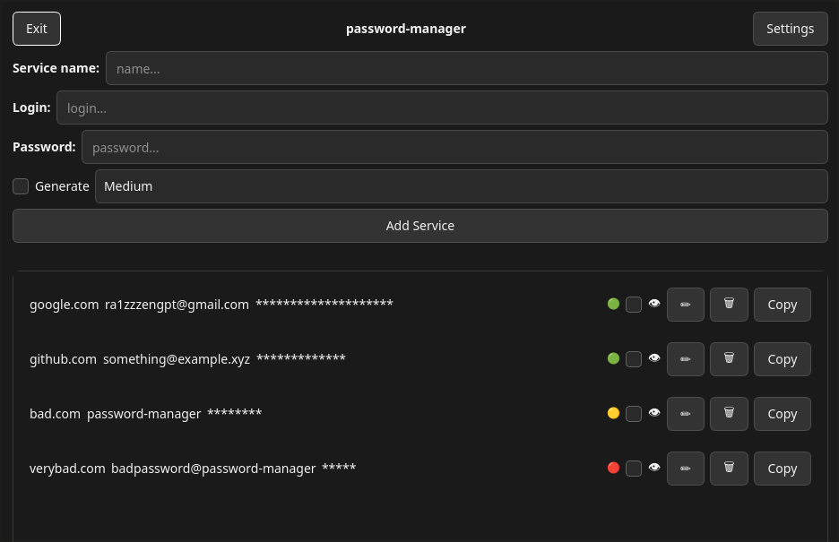
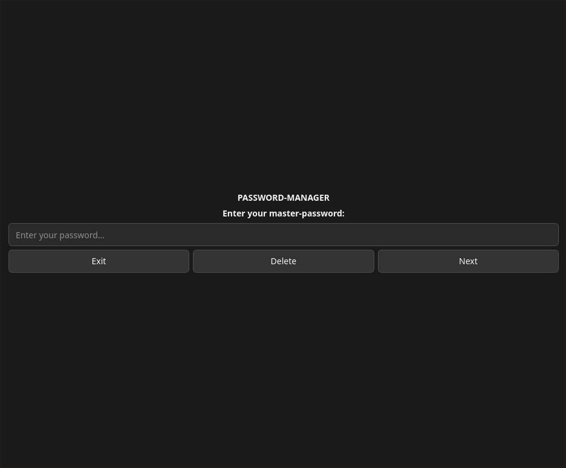
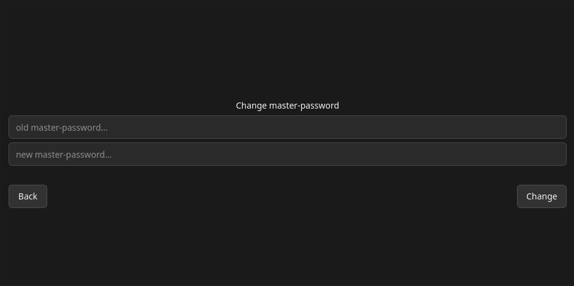

<div align="center">

# Password Manager

**A private, local-first desktop vault for your credentials.**

[](https://github.com/ra1zzzengpt/password-manager/actions/workflows/ci.yml)
[](https://en.cppreference.com/w/cpp/23)
[](https://www.qt.io/)
[](https://cmake.org/)
[](LICENSE.md)

No account. No cloud service. One encrypted vault protected by your master password.

</div>

> [!WARNING]
> Password Manager is under active development and has not undergone an independent security audit. Do not use it as the only copy of critical credentials, and keep backups of important data.



## What it does

- stores credentials in a local encrypted vault;
- adds, edits, and removes entries;
- masks passwords until you choose to reveal them;
- copies passwords to the system clipboard;
- generates passwords with Low, Medium, and High presets;
- displays a simple color-coded password-strength estimate;
- changes the master password and re-encrypts the vault;
- reports critical startup failures through a native dialog;
- writes privacy-conscious diagnostic logs without credential contents.

Password Manager does not require registration and does not upload your vault to a remote server.

## Requirements and platform support

| Component | Requirement |
|---|---|
| Language | C++23 |
| Build system | CMake 3.20 or newer |
| UI framework | Qt 6 Core and Widgets |
| Build tool | Ninja recommended; Make is also supported by CMake |
| Compiler | A compiler and standard library with the required C++23 features, including `std::expected`, `std::format`, and chrono time-zone support |
| Network | Required during the first configuration to download pinned dependencies |

| Operating system | Status | Notes |
|---|:---:|---|
| Linux | ✅ Tested | Built automatically on Ubuntu by GitHub Actions |
| Windows | 🧪 Experimental | The code is intended to be portable, but no installer or maintained build guide is available yet |
| macOS | 🧪 Experimental | The code is intended to be portable, but no app bundle or maintained build guide is available yet |

## Install on Linux

Prebuilt packages are not available yet, so the application must currently be built from source.

### 1. Install build dependencies

Ubuntu or Debian:

```bash
sudo apt update
sudo apt install build-essential cmake git ninja-build qt6-base-dev
```

### 2. Clone and build

```bash
git clone https://github.com/ra1zzzengpt/password-manager.git
cd password-manager

cmake -S . -B build \
  -G Ninja \
  -DCMAKE_BUILD_TYPE=Release \
  -DSODIUM_DISABLE_TESTS=ON

cmake --build build --target password-manager --parallel
```

The first CMake configuration downloads pinned versions of libsodium and nlohmann/json.

### 3. Run

Run the application from the repository root:

```bash
./build/client/password-manager
```

The current version searches the working directory and its parent directories for `client/assets` or `assets`, so launching it from the repository root is recommended.

## First launch

<div align="center">
  
</div>

1. Enter a new master password containing at least 8 characters.
2. Select **Next**.
3. The application creates a new encrypted vault.

Use the same master password on later launches. An incorrect password cannot decrypt the existing vault.

> [!CAUTION]
> A forgotten master password cannot be recovered. The **Delete** button on the unlock screen permanently removes the entire encrypted vault.

## Using the vault

### Add a credential

1. Enter a service name, login, and password.
2. Select **Add Service**.
3. The updated vault is encrypted and saved immediately.

To create a password automatically, enable **Generate**, choose a generation preset, and select the desired length.

### Manage an existing credential

Each entry provides controls to:

- view its password-strength indicator;
- reveal or hide the password;
- edit the service, login, or password;
- remove the entry;
- copy the password with **Copy**.

> [!NOTE]
> A copied password remains in the system clipboard. Other applications may be able to read it, and Password Manager does not clear the clipboard automatically yet.

### Change the master password

<div align="center">
  
</div>

1. Open **Settings**.
2. Enter the current master password.
3. Enter a new password containing at least 8 characters.
4. Select **Change**.

The vault is then encrypted using a key derived from the new master password.

## Local data

| Data | Location | Contents |
|---|---|---|
| Encrypted vault | `client/assets/save/save.save` | Authenticated encrypted credential data |
| Session log | `client/assets/logs/pwd-session.log` | Internal events for the current application run |

The diagnostic log is designed not to contain master passwords, stored passwords, logins, service names, decrypted JSON, or clipboard contents.

Back up the encrypted vault while the application is closed. Never publish it, even though it is encrypted.

## Current limitations

- no prebuilt installer or package;
- no synchronization between devices;
- no automatic backup system;
- no automatic clipboard clearing;
- no versioned vault format or migration system yet;
- no independent security audit;
- Windows and macOS builds are not currently verified by CI.

## Documentation

| Document | Audience | Contents |
|---|---|---|
| [README.md](README.md) | Users | Installation, platform support, and daily usage |
| [CONTRIBUTING.md](CONTRIBUTING.md) | Contributors | Architecture, security rules, development workflow, and testing |

## License

Distributed under the MIT License. See [LICENSE.md](LICENSE.md).
