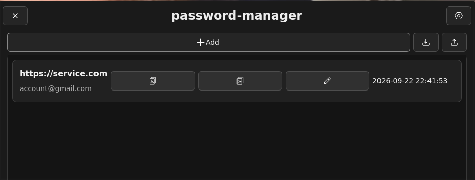

<div align="center">

# Password Manager

**Encrypted C++23/Qt password vault with a self-hosted synchronization server.**

[](https://github.com/ra1zzzengpt/password-manager/actions/workflows/ci.yml)
[](https://en.cppreference.com/w/cpp/23)
[](https://www.qt.io/)
[](https://cmake.org/)
[](LICENSE.md)

The desktop client keeps an encrypted vault on the local device. A separate TLS server can store and synchronize that encrypted vault between clients without receiving its plaintext contents.

</div>

> [!WARNING]
> This project is under active development and has not received an independent security audit. The synchronization and account-authentication implementation is experimental and is not suitable for an untrusted or public production environment. Keep a separate backup of important credentials.



## Current features

- encrypted local credential storage;
- registration and login through the synchronization server;
- automatic version-based vault synchronization every five seconds;
- add, edit, remove, and search credential entries;
- copy logins and passwords to the system clipboard;
- random password generation with Low, Medium, and High presets;
- noun/verb passphrase generation with a configurable separator;
- password-strength estimation;
- master-password changes with vault re-encryption;
- CSV import and export;
- Dark, White, and Nord themes;
- privacy-conscious client file logging and structured server console logging;
- an isolated experimental Android port without server synchronization.

## Architecture

```text
Qt desktop client
  ├── local encrypted vault
  ├── session log and JSON configuration
  └── TLS/HTTP client
            │
            ▼
Boost.Beast TLS server
  ├── PostgreSQL account and vault-version metadata
  └── encrypted vault files under saved/<account-id>/file
```

The client always encrypts and decrypts the vault locally. The server receives the resulting encrypted binary container and uses a monotonically increasing `vault_version` to decide whether the client should upload or fetch a vault. The current synchronization protocol does not merge concurrent edits.

## Security model

The desktop client serializes the vault to JSON in memory and protects it with libsodium:

- the encryption key is derived from the master password with Argon2id (`crypto_pwhash`);
- vault contents are encrypted and authenticated with `crypto_secretbox`;
- a new vault receives a random salt and every save receives a random nonce;
- the binary layout is `nonce || salt || ciphertext-with-MAC`;
- key, salt, and master-password buffers are cleared when the crypto component is destroyed;
- the server stores only the encrypted container, its version, and account metadata.

The master password must contain at least 8 characters. It is not stored and cannot be recovered. The server-account password and the local master password are separate inputs, even if the user chooses the same value for both.

> [!CAUTION]
> Server authentication currently uses a 32-bit value derived with C++ `std::hash`, not a password KDF. The development TLS setup also does not yet enforce complete peer and hostname verification. Do not expose the server directly to the internet or treat the current account protocol as production-grade authentication.

> [!CAUTION]
> The **Delete** button on the master-password screen permanently removes the local encrypted vault. It does not delete the server account or the server-side vault.

## Requirements

| Component | Requirement |
|---|---|
| Language | C++23 |
| Build system | CMake 3.20 or newer |
| Desktop UI | Qt 6 Core and Widgets |
| Cryptography | libsodium with `pkg-config` metadata |
| Networking | Boost.Asio/Beast and OpenSSL |
| Serialization | nlohmann/json |
| Server database | PostgreSQL and libpqxx |
| Compiler | C++23 support for `std::expected`, `std::format`, ranges, and chrono time zones |

The root CMake project builds both the `password-manager` desktop client and the `server` executable. Dependencies must be installed on the system; the desktop build no longer downloads libsodium or nlohmann/json automatically.

### Linux dependencies

Ubuntu or Debian:

```bash
sudo apt update
sudo apt install \
  build-essential cmake git ninja-build pkg-config \
  qt6-base-dev libsodium-dev nlohmann-json3-dev \
  libssl-dev libboost-dev libpqxx-dev postgresql
```

Package names vary between distributions. A recent GCC or Clang toolchain and standard library are required for the C++23 features used by the project.

## Server setup

### 1. Create the PostgreSQL role and database

The following is a minimal development setup. Choose your own names and password:

```sql
CREATE ROLE password_manager WITH LOGIN PASSWORD 'change-me';
CREATE DATABASE password_manager OWNER password_manager;
```

Connect to the new database and create the table expected by the server:

```sql
CREATE TABLE accounts (
    id BIGSERIAL PRIMARY KEY,
    password_hash BIGINT NOT NULL,
    vault_version BIGINT NOT NULL DEFAULT 0,
    vault_path TEXT NOT NULL DEFAULT ''
);
```

### 2. Configure the database connection

Create or update `server/SECRETS.hpp`:

```cpp
#pragma once

#include <string>

inline std::string HOST = "127.0.0.1";
inline std::string PORT = "5432";
inline std::string USERNAME = "password_manager";
inline std::string DBNAME = "password_manager";
inline std::string PASSWORD = "change-me";
```

> [!IMPORTANT]
> `SECRETS.hpp` contains a database password and is not currently excluded by the repository `.gitignore`. Do not commit a real credential.

### 3. Certificates

The repository currently contains development certificate files for local testing:

- `server/certs/server.cert.pem` and `server/certs/server.key.pem` are loaded by the server;
- `client/cert/ca.cert.pem` is loaded by the desktop client.

Replace the development private keys and certificates before deploying anywhere outside a disposable local environment.

The current client loads its CA certificate from an absolute development path in `client/src/controllers/network_controller.cpp`. Until certificate-path discovery is implemented, change the argument to `ctx.load_verify_file(...)` to the absolute path of `client/cert/ca.cert.pem` in your checkout.

## Build

```bash
git clone https://github.com/ra1zzzengpt/password-manager.git
cd password-manager

cmake -S . -B build \
  -G Ninja \
  -DCMAKE_BUILD_TYPE=Release

cmake --build build --parallel
```

To build only one executable:

```bash
cmake --build build --target password-manager --parallel
cmake --build build --target server --parallel
```

## Run

### Start the server

Run the server from its CMake output directory so its current relative certificate paths resolve correctly:

```bash
cd build/server
./server
```

The server listens on `0.0.0.0:6767`. Encrypted vault files are created relative to the server working directory under `saved/<account-id>/file`.

Console output includes timestamps, levels, components, connection IDs, HTTP routes and statuses, request duration, database operations, synchronization decisions, and errors:

```text
[2026-10-09 21:30:26.631] [INFO ] [server] starting password manager server
[2026-10-09 21:30:26.640] [INFO ] [listener] listening on 0.0.0.0:6767
```

Password hashes and vault contents are intentionally not printed.

### Start the desktop client

From the repository root:

```bash
./build/client/password-manager
```

The application searches the current directory and up to three parent directories for `client/assets` or `assets`. Running it from the repository root or its CMake build directory keeps resource discovery predictable.

## First launch and sign-in

If `client/assets/config.conf` is missing or invalid, the application opens a configuration dialog. Select a theme and enter the synchronization server host and port. For the default local server, use:

```json
{
    "host": "localhost",
    "port": "6767",
    "sync": true,
    "theme": "dark"
}
```

The normal startup flow is:

1. Register a server account or log in with an existing account ID and account password.
2. Enter the local master password, which must contain at least 8 characters.
3. The client opens an existing local vault or creates a new encrypted vault.
4. The background synchronizer checks the server every five seconds and uploads or fetches the encrypted vault according to its version.

> [!NOTE]
> Registration creates an account ID, but the current registration screen does not display or persist it. During development it can be obtained from the server console or PostgreSQL. Save it before restarting the client.

The `sync` field is already part of the configuration format, but the current desktop flow still opens server authentication even when it is set to `false`.

## Using the vault

### Add and find credentials

Select **Add**, enter the service name, login, and password, then select **Add Service**. The encrypted local vault is saved immediately and its version is incremented.

With **Generate** enabled, the client can create either:

- a symbol-based password using Low, Medium, or High presets and a length from 8 to 500 characters; or
- a 3–50 word noun/verb passphrase with a custom separator.

The main screen has case-insensitive filters for both service name and login. Each credential card supports copying the login or password, viewing details, editing, and deletion.

> [!NOTE]
> Copied values remain in the system clipboard until another application replaces them. Password Manager does not currently clear the clipboard automatically.

### Settings

The settings dialog can:

- change the master password and re-encrypt the local vault;
- switch between Dark, White, and Nord themes.

The selected theme is saved in `client/assets/config.conf`. Changing the server host, port, or synchronization option currently requires editing or recreating that configuration file.

### CSV import and export

Import expects a header row and reads the first three comma-separated columns:

```csv
url,login,password
https://example.com,user@example.com,secret
```

Empty records are skipped. Export writes to `client/assets/export/export.csv`.

> [!CAUTION]
> CSV files are plaintext and expose every exported login and password. Store them securely and delete them when they are no longer needed.

CSV support is experimental. Quoted commas, embedded newlines, and a lossless export/import round trip are not reliably supported yet.

## HTTP API

All current endpoints use JSON bodies over TLS:

| Method | Route | Purpose |
|---|---|---|
| `POST` | `/registration` | Create an account and return its ID |
| `POST` | `/login` | Validate an account ID and password hash |
| `GET` | `/vault/get` | Compare the client and server vault versions |
| `GET` | `/vault/fetch` | Download the encrypted vault container |
| `POST` | `/vault/new` | Upload an encrypted vault and update its version |

The two `GET` routes currently carry JSON request bodies. This works with the bundled client and server but is not conventional HTTP API design.

## Runtime files

Client paths below are relative to the discovered assets directory:

| Path | Purpose | Protected? |
|---|---|:---:|
| `client/assets/save/save.save` | Local encrypted credential vault | Yes |
| `client/assets/config.conf` | Theme and server connection settings | No |
| `client/assets/logs/pwd-session.log` | Diagnostic events from the current client session | No |
| `client/assets/export/export.csv` | Optional CSV export containing credentials | **No** |

The client log is recreated for every run and is designed not to include passwords, logins, service names, decrypted JSON, or clipboard contents.

Server runtime data:

| Path or store | Purpose | Protected? |
|---|---|:---:|
| `saved/<account-id>/file` | Client-produced encrypted vault | Yes |
| PostgreSQL `accounts` table | Account hash, vault version, and vault path | No |
| Console output | Structured operational logs | No secrets by design |

Back up vault files only while the corresponding application is stopped. Never publish a vault, CSV export, database credentials, or private TLS keys.

## Android port

An experimental, isolated Qt/C++ Android client lives in [`android-port/`](android-port/README.md). It uses Android's private application-data directory, requests neither network nor external-storage permissions, and excludes the encrypted vault from Android backup.

The Android port does not include the new desktop synchronization flow. It requires Qt 6.8 or newer with an Android `arm64-v8a` kit and still needs real-device validation. See the [Android build guide](android-port/README.md) for setup details.

## Current limitations

- server authentication uses a non-cryptographic 32-bit password hash;
- TLS certificate verification and hostname validation are not production-ready;
- the client CA path and server certificate paths are currently environment-sensitive;
- registration does not display or persist the new account ID;
- the `sync: false` configuration is not yet honored by the main desktop flow;
- synchronization uses polling and whole-vault replacement, with no merge or conflict-resolution protocol;
- concurrent clients can overwrite one another when they upload the same version;
- no server-side account deletion, rate limiting, sessions, or recovery flow;
- no database migrations, automatic server backup, or configurable server listen address;
- no automatic local vault backup or clipboard clearing;
- no versioned cryptographic container format or migration system;
- CSV support is incomplete and exports plaintext secrets;
- no project-specific automated test suite yet;
- no prebuilt desktop packages or installers;
- no independent security audit;
- Android packaging and device behavior still require validation.

## Repository layout

```text
.
├── client/                    Qt desktop client and bundled assets
│   ├── cert/                  client CA certificate
│   ├── src/
│   │   ├── controllers/      storage, configuration, and networking
│   │   ├── crypto/           libsodium wrapper and vault container
│   │   ├── domain/           credential, configuration, and error models
│   │   ├── generate/         password/passphrase generation and strength
│   │   ├── logs/             per-session file logger
│   │   ├── ui/               Qt widgets and dialogs
│   │   └── utils/            CSV parser and helpers
│   └── assets/               themes, icons, wordlists, and runtime data
├── server/                    TLS synchronization server
│   ├── connection/           per-client TLS/HTTP connection handling
│   ├── database/             PostgreSQL access
│   ├── handlers/             HTTP routing and vault file operations
│   ├── listener/             TCP listener
│   ├── logging/              structured console logger
│   └── certs/                development server certificates
├── android-port/             isolated experimental Android application
├── img/                      documentation screenshots
├── .github/workflows/        cross-platform CI configuration
├── CMakeLists.txt            root project configuration
└── CONTRIBUTING.md           contributor documentation
```

## Tests and contributing

To run all tests registered with CMake:

```bash
ctest --test-dir build --build-config Release --output-on-failure
```

The project does not currently register its own automated tests. Architecture notes and the contribution workflow are in [CONTRIBUTING.md](CONTRIBUTING.md); parts of that guide still describe the earlier local-only client architecture and need the same client/server refresh.

## License

Distributed under the MIT License. See [LICENSE.md](LICENSE.md).
